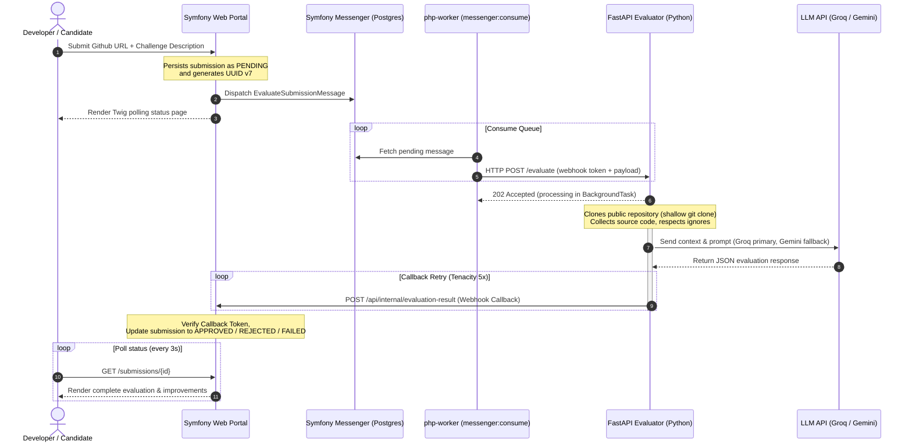

# 🚀 Technical Challenge Reviewer

[](https://symfony.com/)
[](https://fastapi.tiangolo.com/)
[](https://www.docker.com/)
[](https://www.postgresql.org/)
[](https://www.python.org/)
[](https://www.php.net/)

A distributed asynchronous system that ingests GitHub repository submissions and evaluates them with LLMs. Built with a decoupled microservice architecture: web orchestration and persistence in Symfony, shallow repository cloning and multi-provider LLM evaluation in FastAPI.

---

## 🏗️ System Architecture & Workflow

The application is split into two primary services behind an **Nginx** reverse proxy:
1. **Symfony Portal (PHP 8.4)**: Challenge definition, submission intake (candidate name + repo URL), persistent database state, status page polling, and asynchronous message dispatching.
2. **Evaluator Microservice (Python 3.12)**: A FastAPI service that clones repositories, collects source files, calls LangChain-based LLM APIs, and reports results via authenticated webhooks.



**Status meanings**
| Status | Meaning | Retryable |
| :--- | :--- | :--- |
| `pending` | Queued, not yet picked up by worker | Yes |
| `processing` | Worker dispatched evaluation to Python | Yes |
| `approved` | Evaluation completed: meets requirements | No |
| `rejected` | Evaluation completed: does not meet requirements | No |
| `failed` | Infrastructure/process error (dispatch, clone, etc.) | Yes |

---

## 🔑 Key Engineering & Architectural Highlights

### 1. Resilient AI Pipeline
- **Dual LLM Fallback**: Defaults to **Groq (Llama-3.3-70b-versatile)**, then **Gemini (gemini-2.0-flash-lite)** if the primary provider fails.
- **Heuristic Degraded Mode**: If API keys are missing **or** all providers fail, the evaluator returns a deterministic non-crashing fallback result so the queue stays unblocked.
- **Robust JSON Extraction**: Regex-based pre-processing extracts clean JSON even when models wrap output in markdown fences or conversational text.

### 2. Message-Driven Queue (Low Ops Footprint)
- **Symfony Messenger + Doctrine DSN**: PostgreSQL tables act as the message queue (no RabbitMQ/Redis required for low–medium volume).
- **Persist-then-dispatch**: Submissions are flushed to the database, then messages are dispatched to the transport. Swap to RabbitMQ/AMQP by changing only `MESSENGER_TRANSPORT_DSN`.
- **Failed transport**: After Messenger retries are exhausted, messages land in the Doctrine `failed` queue for inspection/retry.

### 3. Fail-Safe Webhooks (DLQ & Cron Replay)
- **Async execution**: FastAPI returns `202 Accepted` and runs clone + LLM work in a `BackgroundTask`.
- **Tenacity retries**: Callbacks to Symfony use 5 attempts with exponential backoff (`2s`–`30s`).
- **File-based DLQ**: After retries fail, payloads are appended to `/tmp/failed_callbacks.jsonl`.
- **Background replayer**: `callback_replayer.py` runs every 60s (started in FastAPI `lifespan`) to redeliver DLQ entries when Symfony recovers.
- **`failed` flag**: Process/infrastructure errors set `failed: true` on the callback so Symfony marks the submission `FAILED` (not `REJECTED`).

---

## 🧑‍💻 Codebase Directory & Key Logic Map

### Symfony Portal (`symfony/src/`)
*   [ChallengeController.php](symfony/src/Controller/ChallengeController.php) / [SubmissionController.php](symfony/src/Controller/SubmissionController.php) — Frontend entry points and submission orchestration.
*   [InternalCallbackController.php](symfony/src/Controller/InternalCallbackController.php) — Secures evaluation callbacks with token-based auth.
*   [EvaluateSubmissionMessage.php](symfony/src/Message/EvaluateSubmissionMessage.php) — Serializable message payload for the worker.
*   [EvaluationRequestHandler.php](symfony/src/MessageHandler/EvaluationRequestHandler.php) — Consumes queue events and POSTs to the FastAPI evaluator; marks `FAILED` on dispatch errors.
*   [CallbackAuthenticator.php](symfony/src/Service/CallbackAuthenticator.php) — Verifies internal callback tokens.

### Python Evaluator (`python-service/app/`)
*   [main.py](python-service/app/main.py) — FastAPI routes: `/evaluate`, `/health`, DLQ admin endpoints.
*   [evaluator.py](python-service/app/evaluator.py) — Orchestrates clone metadata, file collection, and LLM evaluation.
*   [llm_provider.py](python-service/app/llm_provider.py) — Groq → Gemini fallback and heuristic degraded mode.
*   [file_collector.py](python-service/app/file_collector.py) — Collects relevant source files, skips binaries/vendor dirs, truncates payload size.
*   [symfony_client.py](python-service/app/symfony_client.py) — HTTP callback client with Tenacity retries and DLQ logging.
*   [callback_replayer.py](python-service/app/callback_replayer.py) — Periodic DLQ redelivery loop.

---

## 🛠️ Tech Stack & Design Patterns

| Layer | Technology | Key Patterns / Features |
| :--- | :--- | :--- |
| **Orchestration & API** | Symfony 7.3 (PHP 8.4) | Doctrine ORM entities, form/API validation, Messenger, Twig UI |
| **Worker Queue** | Symfony Messenger | Auto-retries, failed transport, Doctrine DSN |
| **Microservice Backend** | FastAPI (Python 3.12) | BackgroundTasks, lifespan hooks, admin DLQ endpoints |
| **AI Integration** | LangChain | Prompt templates, multi-provider clients, JSON extraction |
| **Database** | PostgreSQL 17 | UUID v7 identifiers, relational schemas, message transport |
| **Infrastructure** | Docker Compose, Nginx | Multi-container composition, reverse proxy |

---

## 💻 Quick Start & Environment Configuration

### Prerequisites
- Docker and Docker Compose (Compose V2 plugin)
- (Optional but recommended) Groq/Gemini API keys for live AI evaluations

### Setup Instructions

```bash
# 1. Clone the repository and enter the directory
cd technical_challenge_reviewer

# 2. Configure environment variables
cp .env.example .env
# Open .env and set:
# GROQ_API_KEY=gsk_...
# GEMINI_API_KEY=...
# CALLBACK_TOKEN=some_secure_secret_token

# 3. Build and spin up containers in detached mode
docker compose up --build -d
```

> [!NOTE]
> On container startup, the PHP entrypoint runs Composer install, database migrations, messenger transport setup, and initializes the test database (when `APP_ENV` is not `test`).

### Access Ports
- **Frontend Dashboard**: [http://localhost:8080](http://localhost:8080)
- **FastAPI Interactive Docs (Swagger UI)**: [http://localhost:8001/docs](http://localhost:8001/docs)
- **PostgreSQL Database**: `localhost:5432` (Username: `app`, Password: `app`, DB: `challenge_reviewer`)

### Important environment variables

| Variable | Used by | Purpose |
| :--- | :--- | :--- |
| `DATABASE_URL` | Symfony / worker | Postgres DSN (must match `POSTGRES_*`) |
| `CALLBACK_TOKEN` | Symfony + Python | Shared webhook auth secret |
| `SYMFONY_CALLBACK_URL` | Symfony + Python | Internal callback URL (Docker network) |
| `PYTHON_EVALUATOR_URL` | Symfony worker | Evaluator base URL |
| `GROQ_API_KEY` / `GEMINI_API_KEY` | Python | LLM credentials |
| `LLM_PROVIDER` | Python | `auto` \| `groq` \| `gemini` |

---

## 🧪 Testing & Code Quality

### Symfony (PHPUnit)
```bash
docker compose exec php php bin/phpunit --testdox
```
Covers entity transitions, callback security, message handlers (including `FAILED` on dispatch errors), and controller integrations.

### FastAPI (Pytest)
```bash
docker compose exec python-evaluator pytest -v
```
Covers file collection/truncation, callback retries + DLQ replayer, LLM fallback chains, and API endpoints (challenge text min length aligned with Symfony: 20 chars).

### Run both
```bash
make test
```

---

## 🔍 Evaluator Microservice API & DLQ Control

### Health Check Endpoint
```bash
curl http://localhost:8001/health
# {"status":"ok","service":"python-evaluator","llm_provider":"groq","groq_configured":true,"gemini_configured":false}
```

### DLQ Management
Failures retry every 60s automatically; you can also inspect or force replay:
```bash
# Check status and current size of the DLQ
curl http://localhost:8001/admin/replay-status
# {"failed_callbacks":0,"path":"/tmp/failed_callbacks.jsonl","replay_interval":60}

# Force manual replay of all failed webhooks in the queue
curl -X POST http://localhost:8001/admin/replay-failed-callbacks
# {"total":1,"replayed":1,"still_failing":0}
```

---

## 🔒 Production Readiness & Scaling Strategy

While this project is configured as a proof-of-concept, it is architected with a clear scaling route:

1. **Webhook HMAC signatures**: Prefer SHA-256 HMAC body signatures over a static `X-Internal-Token` header to limit replay risk.
2. **Ephemeral sandboxed cloning**: Isolate the Python cloner in short-lived, read-only containers or microVMs (e.g. Firecracker).
3. **Queue scalability**: Point `MESSENGER_TRANSPORT_DSN` at RabbitMQ or SQS and scale `php-worker` replicas.
4. **Caching & deduplication**: Cache results by repository commit hash to skip re-evaluating identical trees.

---

## 📄 License
This project is licensed under the MIT License — see the [LICENSE](LICENSE) file for details.
