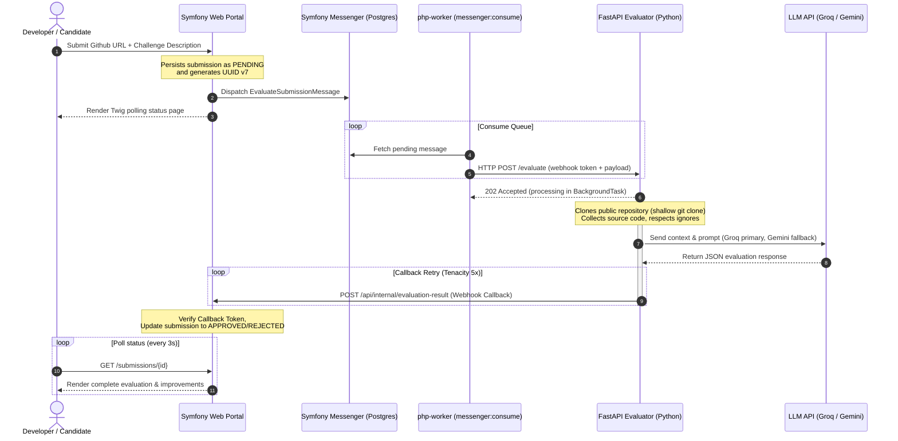

# 🚀 Technical Challenge Reviewer

[](https://symfony.com/)
[](https://fastapi.tiangolo.com/)
[](https://www.docker.com/)
[](https://www.postgresql.org/)
[](https://www.python.org/)
[](https://www.php.net/)

A production-grade, distributed asynchronous system designed to ingest, process, and automatically evaluate GitHub repository submissions using LLMs. Built with a decoupled microservice architecture, the system coordinates web request orchestration, transactional persistence, asynchronous message queuing, shallow repository cloning, and resilient multi-provider LLM pipelines.

---

## 🏗️ System Architecture & Workflow

The application is split into two primary services behind an **Nginx** reverse proxy:
1. **Symfony Portal (PHP 8.4)**: Handles user registration, challenge definition, persistent database state, status page polling, and asynchronous message dispatching.
2. **Evaluator Microservice (Python 3.12)**: A lightweight FastAPI service that clones repositories, collects codebases, interacts with LangChain-based LLM APIs, and sends evaluations back via authenticated webhooks.



---

## 🔑 Key Engineering & Architectural Highlights

### 1. Resilient & High-Availability AI Pipeline
Integration with external LLM APIs is a common point of failure. To guarantee uptime and service continuity:
- **Dual LLM Fallback Mechanism**: The Python evaluator service implements a tiered execution strategy using `LangChain`. It defaults to **Groq (Llama-3.3-70b-versatile)** for sub-second responses, automatically falling back to **Gemini (gemini-2.0-flash-lite)** if the primary provider fails (e.g., due to rate limits or network issues).
- **Graceful Heuristic Degraded Mode**: If both API keys are absent or both services fail, the system falls back to a deterministic heuristic evaluator, preventing crashes and keeping the queue unblocked.
- **Robust Output Parsers**: Utilizes LangChain's `JsonOutputParser` with regex-based pre-processing to reliably extract clean JSON evaluations even if models output conversational metadata or markdown fences.

### 2. Message-Driven Queue Design (Zero-Ops Footprint)
- **Symfony Messenger with Doctrine DSN**: Evaluations are processed out-of-band using Symfony Messenger mapped to PostgreSQL database tables as the message queue. This eliminates the operational complexity, memory footprint, and hosting cost of RabbitMQ or Redis for low-to-medium volumes, while retaining the exact same messaging API.
- **Outbox Pattern and Transactional Boundaries**: Submissions are stored in PostgreSQL and messages are pushed to the transport queue atomically. If database persistence fails, no message is sent, preventing phantom worker tasks.
- **Swappable DSN**: Transitioning to RabbitMQ (AMQP) requires zero code changes—only a modification to the `MESSENGER_TRANSPORT_DSN` environment variable.

### 3. Distributed Reliability & Fail-Safe Webhooks (DLQ & Cron Replay)
- **Asynchronous Execution Model**: The FastAPI service returns a `202 Accepted` immediately upon payload reception, spinning off code cloning and LLM invocation to a FastAPI `BackgroundTask`.
- **Tenacity Callback Retry Engine**: The callback endpoint (reporting the evaluation outcome to Symfony) is protected against network blips and target service downtime via a 5-step exponential backoff retry strategy (`2s` up to `30s`).
- **File-Based Dead-Letter Queue (DLQ)**: If all 5 retries fail, callbacks are persisted in a line-delimited JSON log (`/tmp/failed_callbacks.jsonl`) allowing manual replay or monitoring triggers.
- **Background Cron Replayer**: A background replayer script (`callback_replayer.py`) runs every 60 seconds (initiated in the FastAPI `lifespan` block) to automatically replay the DLQ and process failures as soon as Symfony recovers.

---

## 🧑‍💻 Codebase Directory & Key Logic Map

### Symfony Portal (`symfony/src/`)
*   [ChallengeController.php](file:///home/gacar/technical_challenge_reviewer/symfony/src/Controller/ChallengeController.php) / [SubmissionController.php](file:///home/gacar/technical_challenge_reviewer/symfony/src/Controller/SubmissionController.php) — Entry points for frontend interaction and submission orchestration.
*   [InternalCallbackController.php](file:///home/gacar/technical_challenge_reviewer/symfony/src/Controller/InternalCallbackController.php) — Secures incoming evaluation reports using token-based authentication.
*   [EvaluateSubmissionMessage.php](file:///home/gacar/technical_challenge_reviewer/symfony/src/Message/EvaluateSubmissionMessage.php) — The serializable message payload passed between threads/workers.
*   [EvaluationRequestHandler.php](file:///home/gacar/technical_challenge_reviewer/symfony/src/MessageHandler/EvaluationRequestHandler.php) — Consumes queue events and triggers outbound webhook requests to the FastAPI evaluator.
*   [CallbackAuthenticator.php](file:///home/gacar/technical_challenge_reviewer/symfony/src/Service/CallbackAuthenticator.php) — Verifies internal callback signatures to prevent unauthorized payload tampering.

### Python Evaluator (`python-service/app/`)
*   [main.py](file:///home/gacar/technical_challenge_reviewer/python-service/app/main.py) — FastAPI routing table exposing `/evaluate`, `/health`, and DLQ admin endpoints.
*   [evaluator.py](file:///home/gacar/technical_challenge_reviewer/python-service/app/evaluator.py) — Integrates git shallow clone operations, file collection, and prompt-based API evaluations.
*   [llm_provider.py](file:///home/gacar/technical_challenge_reviewer/python-service/app/llm_provider.py) — Handles fallback sequence between Groq and Gemini API clients.
*   [file_collector.py](file:///home/gacar/technical_challenge_reviewer/python-service/app/file_collector.py) — Parses repository files, filters binaries/unwanted folders (e.g. `node_modules`), and prepares clean text payloads for the LLM.
*   [symfony_client.py](file:///home/gacar/technical_challenge_reviewer/python-service/app/symfony_client.py) — Robust HTTP callback sender utilizing `tenacity` retry loops and fallback DLQ logging.
*   [callback_replayer.py](file:///home/gacar/technical_challenge_reviewer/python-service/app/callback_replayer.py) — Automated loop that monitors `/tmp/failed_callbacks.jsonl` and attempts redelivery.

---

## 🛠️ Tech Stack & Design Patterns

| Layer | Technology | Key Patterns / Features |
| :--- | :--- | :--- |
| **Orchestration & API** | Symfony 7.3 (PHP 8.4) | Domain-Driven Entities (Doctrine ORM), Rich Form Validation, Custom Messengers, Command Line Console |
| **Worker Queue** | Symfony Messenger | Auto-retries, Failed Transport queues, Transactional messaging via Postgres |
| **Microservice Backend** | FastAPI (Python 3.12) | Asynchronous Endpoint definitions, Dependency Injection, FastAPI BackgroundTasks |
| **AI Integration** | LangChain | Decoupled system & human prompt templates, JSON parsing, API fallback routing |
| **Database** | PostgreSQL 17 | UUID v7 identifiers, relational schemas, integrated message transport |
| **Infrastructure** | Docker, Nginx | Multi-container composition, decoupled service networking, unified entrypoint proxy |

---

## 💻 Quick Start & Environment Configuration

### Prerequisites
- Docker & Docker Compose v5+
- (Optional but recommended) Groq/Gemini API keys for active AI evaluations.

### Setup Instructions

```bash
# 1. Clone the repository and enter the directory
cd technical_challenge_reviewer

# 2. Configure environment variables
cp .env.example .env
# Open .env and set:
# GROQ_API_KEY=gsk_...
# GEMINI_API_KEY=...
# CALLBACK_TOKEN=some_secure_secret_token

# 3. Build and spin up containers in detached mode
docker compose up --build -d
```

> [!NOTE]
> On container startup, the application automatically runs Composer installation, database migrations, message queue transport setup, and initializes the test database environment via the automated entrypoint script.

### Access Ports
- **Frontend Dashboard**: [http://localhost:8080](http://localhost:8080)
- **FastAPI Interactive Docs (Swagger UI)**: [http://localhost:8001/docs](http://localhost:8001/docs)
- **PostgreSQL Database**: `localhost:5432` (Username: `app`, Password: `app`, DB: `challenge_reviewer`)

---

## 🧪 Testing & Code Quality

The system is developed with a strict focus on testability, using unit, functional, and mock testing patterns to guarantee logic completeness.

### Symfony (PHPUnit Suite)
Contains **35+ tests** covering unit validations, entity state transitions, message handlers, and controller integrations.
```bash
docker compose exec php php bin/phpunit --testdox
```
*Tested Areas:*
- **Submission Status Transitions**: Ensures transition safety state machine paths (e.g., `PENDING` -> `PROCESSING` -> `APPROVED`/`REJECTED`).
- **Webhook Callback Security**: Ensures Symfony denies unauthorized callback payloads using bad tokens.
- **Asynchronous Webhook Client Mocks**: Uses Symfony's `MockHttpClient` to test outbound evaluator calls without executing actual network requests.

### FastAPI (Pytest Suite)
Contains **22+ tests** covering repository isolation, AST/file aggregation, payload retries, DLQ replayer, and API endpoints.
```bash
docker compose exec python-evaluator pytest -v
```
*Tested Areas:*
- **File Collector Truncation**: Validates that Python service ignores binary artifacts (`node_modules`, `.git`, `vendor`) and restricts LLM ingestion payload length.
- **Tenacity Webhook Client**: Verifies retry strategies on mock remote host failures.
- **Fallback Chains**: Validates mock Groq API failures trigger Gemini pipelines correctly.
- **Callback Replayer**: Verifies processing of empty file queues, successfully cleared logs, and re-attempt loops.

---

## 🔍 Evaluator Microservice API & DLQ Control

### Health Check Endpoint
```bash
curl http://localhost:8001/health
# {"status":"ok","llm_provider":"groq","groq_configured":true,"gemini_configured":false}
```

### DLQ Management
While failures automatically retry every 60s, you can inspect or trigger redelivery manually:
```bash
# Check status and current size of the DLQ
curl http://localhost:8001/admin/replay-status
# {"failed_callbacks":0,"path":"/tmp/failed_callbacks.jsonl","replay_interval":60}

# Force manual replay of all failed webhooks in the queue
curl -X POST http://localhost:8001/admin/replay-failed-callbacks
# {"total":1,"replayed":1,"still_failing":0}
```

---

## 🔒 Production Readiness & Scaling Strategy

While this project is configured as a proof-of-concept, it is architected with a clear scaling route:

1. **Webhook HMAC Signature validation**: Instead of matching a static `X-Internal-Token` header, verify callbacks using SHA256 HMAC request body signatures to prevent replay attacks.
2. **Ephemeral Sandboxed Cloning**: Isolate the Python repository cloner within short-lived, read-only Docker containers or VM microVMs (e.g., Firecracker) to safely review arbitrary code submissions.
3. **Queue Scalability**: Swap the `MESSENGER_TRANSPORT_DSN` to a dedicated RabbitMQ cluster or Amazon SQS and scale the `php-worker` container replicas horizontally.
4. **Caching & Deduplication**: Cache evaluation results based on repository git commit hashes. If a user submits the same repository commit twice, serve the cached result immediately.

---

## 📄 License
This project is licensed under the MIT License - see the LICENSE file for details.
