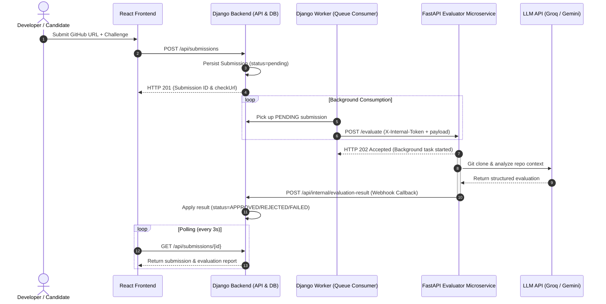

# 🚀 Technical Challenge Reviewer

[](https://react.dev/)
[](https://vitejs.dev/)
[](https://www.djangoproject.com/)
[](https://fastapi.tiangolo.com/)
[](https://www.docker.com/)
[](https://www.postgresql.org/)
[](https://www.python.org/)

A distributed asynchronous system that ingests GitHub repository submissions and evaluates them with LLMs. Built with a decoupled microservice architecture: web orchestration, REST APIs, and database persistence in Django, and repository cloning with multi-provider LLM evaluation in FastAPI.

---

## 🏗️ System Architecture & Workflow

The application is split into three primary services behind an **Nginx** reverse proxy:
1. **React SPA Frontend**: A modern client-side application built with Vite and Tailwind CSS v4.
2. **Django API (Python 3.12)**: A pure JSON REST API for challenge definition, submission intake, persistent database state, and background queue workers.
3. **Evaluator Microservice (Python 3.12)**: A FastAPI service that clones repositories, collects source files, calls LangChain-based LLM APIs, and reports results via authenticated webhooks.


```mermaid
sequenceDiagram
    autonumber
    actor User as Developer / Candidate
    participant SPA as React Frontend
    participant Django as Django Backend (API & DB)
    participant Worker as Django Worker (Queue Consumer)
    participant Evaluator as FastAPI Evaluator Microservice
    participant LLM as LLM API (Groq / Gemini)

    User->>SPA: Submit GitHub URL + Challenge
    SPA->>Django: POST /api/submissions
    Django->>Django: Persist Submission (status=pending)
    Django-->>SPA: HTTP 201 (Submission ID & checkUrl)

    loop Background Consumption
        Worker->>Django: Pick up PENDING submission
        Worker->>Evaluator: POST /evaluate (X-Internal-Token + payload)
    end
    Evaluator-->>Worker: HTTP 202 Accepted (Background task started)

    activate Evaluator
    Evaluator->>LLM: Git clone & analyze repo context
    LLM-->>Evaluator: Return structured evaluation
    Evaluator->>Django: POST /api/internal/evaluation-result (Webhook Callback)
    deactivate Evaluator

    Django->>Django: Apply result (status=APPROVED/REJECTED/FAILED)
    
    loop Polling (every 3s)
        SPA->>Django: GET /api/submissions/{id}
        Django-->>SPA: Return submission & evaluation report
    end
```

**Status meanings**
| Status | Meaning | Retryable |
| :--- | :--- | :--- |
| `pending` | Queued, not yet picked up by worker | Yes |
| `processing` | Worker dispatched evaluation to Python | Yes |
| `approved` | Evaluation completed: meets requirements | No |
| `rejected` | Evaluation completed: does not meet requirements | No |
| `failed` | Infrastructure/process error (dispatch, clone, etc.) | Yes |

---

## 🔑 Key Engineering & Architectural Highlights

### 1. Resilient AI Pipeline
- **Dual LLM Fallback**: Defaults to **Groq (Llama-3.3-70b-versatile)**, then **Gemini (gemini-2.0-flash-lite)** if the primary provider fails.
- **Heuristic Degraded Mode**: If API keys are missing **or** all providers fail, the evaluator returns a deterministic non-crashing fallback result so the queue stays unblocked.
- **Robust JSON Extraction**: Regex-based pre-processing extracts clean JSON even when models wrap output in markdown fences or conversational text.

### 2. Message-Driven Queue (Django Worker)
- **Persist-then-dispatch**: Submissions are saved to PostgreSQL with status `pending`, then processed asynchronously by background worker threads / management command `run_worker`.
- **Fail-safe Retries**: Allows retry of failed/stuck evaluations cleanly via `/api/submissions/{id}/retry`.

### 3. Fail-Safe Webhooks (DLQ & Cron Replay)
- **Async execution**: FastAPI returns `202 Accepted` and runs clone + LLM work in a `BackgroundTask`.
- **Tenacity retries**: Callbacks to Django use 5 attempts with exponential backoff (`2s`–`30s`).
- **File-based DLQ**: After retries fail, payloads are appended to `/tmp/failed_callbacks.jsonl`.
- **Background replayer**: `callback_replayer.py` runs every 60s (started in FastAPI `lifespan`) to redeliver DLQ entries when Django recovers.
- **`failed` flag**: Process/infrastructure errors set `failed: true` on the callback so Django marks the submission `FAILED` (not `REJECTED`).

---

## 🧑‍💻 Codebase Directory & Key Logic Map

### React Frontend (`react-frontend/`)
* Built with **Vite**, **React 19**, and **Tailwind CSS v4**.
* Configured with **Vitest** for component testing and **Playwright** for End-to-End (E2E) UI testing.
* Provides real-time polling to display evaluation feedback asynchronously.

### Django API (`django-backend/`)
*   `reviewer/models.py` — Challenge and Submission ORM models with domain state transition logic.
*   `reviewer/views.py` — REST API endpoints for frontend and internal evaluation webhook callbacks.
*   `reviewer/utils.py` — Async HTTP evaluator dispatch utility.
*   `reviewer/management/commands/run_worker.py` — Background queue worker command.

### Python Evaluator (`python-service/app/`)
*   `main.py` — FastAPI routes: `/evaluate`, `/health`, DLQ admin endpoints.
*   `evaluator.py` — Orchestrates clone metadata, file collection, and LLM evaluation.
*   `llm_provider.py` — Groq → Gemini fallback and heuristic degraded mode.
*   `file_collector.py` — Collects relevant source files, skips binaries/vendor dirs, truncates payload size.
*   `symfony_client.py` — HTTP callback client with Tenacity retries and DLQ logging.
*   `callback_replayer.py` — Periodic DLQ redelivery loop.

---

## 🛠️ Tech Stack & Design Patterns

| Layer | Technology | Key Patterns / Features |
| :--- | :--- | :--- |
| **Frontend SPA** | React 19 (Vite) | Tailwind v4, Playwright E2E, Vitest |
| **Orchestration & API** | Django 5.1 (Python 3.12) | DRF Serializers, ORM Models, Admin Panel |
| **Worker Queue** | Django Management Worker | Asynchronous HTTP dispatching, state machine |
| **Microservice Backend** | FastAPI (Python 3.12) | BackgroundTasks, lifespan hooks, admin DLQ endpoints |
| **AI Integration** | LangChain | Prompt templates, multi-provider clients, JSON extraction |
| **Database** | PostgreSQL 17 | UUID identifiers, relational schemas |
| **Infrastructure** | Docker Compose, Nginx | Multi-container composition, reverse proxy |

---

## 💻 Quick Start & Environment Configuration

### Prerequisites
- Docker and Docker Compose (Compose V2 plugin)
- (Optional but recommended) Groq/Gemini API keys for live AI evaluations

### Setup Instructions

```bash
# 1. Clone the repository and enter the directory
cd technical_challenge_reviewer

# 2. Configure environment variables
cp .env.example .env
# Open .env and set:
# GROQ_API_KEY=gsk_...
# GEMINI_API_KEY=...
# CALLBACK_TOKEN=some_secure_secret_token

# 3. Build and spin up containers in detached mode
docker compose up --build -d
```

### Access Ports
- **Frontend Dashboard (React)**: [http://localhost:3000](http://localhost:3000)
- **Backend API (Django)**: [http://localhost:8080/api/submissions](http://localhost:8080/api/submissions)
- **FastAPI Interactive Docs (Swagger UI)**: [http://localhost:8001/docs](http://localhost:8001/docs)
- **PostgreSQL Database**: `localhost:5432` (Username: `app`, Password: `app`, DB: `challenge_reviewer`)

---

## 🧪 Testing & Code Quality

### Django Tests
```bash
docker compose exec django python manage.py test
```

### FastAPI (Pytest)
```bash
docker compose exec python-evaluator pytest -v
```

### Run all backend tests
```bash
make test
```

---

## 📄 License
This project is licensed under the MIT License — see the [LICENSE](LICENSE) file for details.
